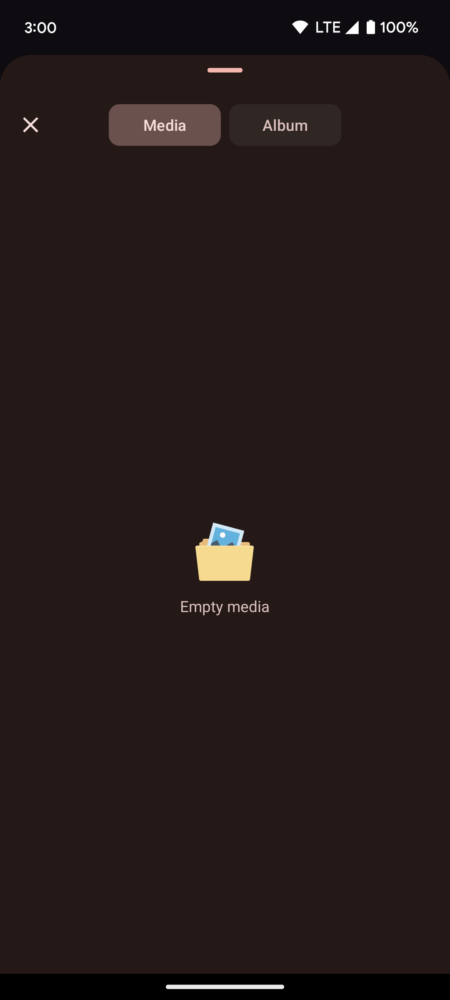
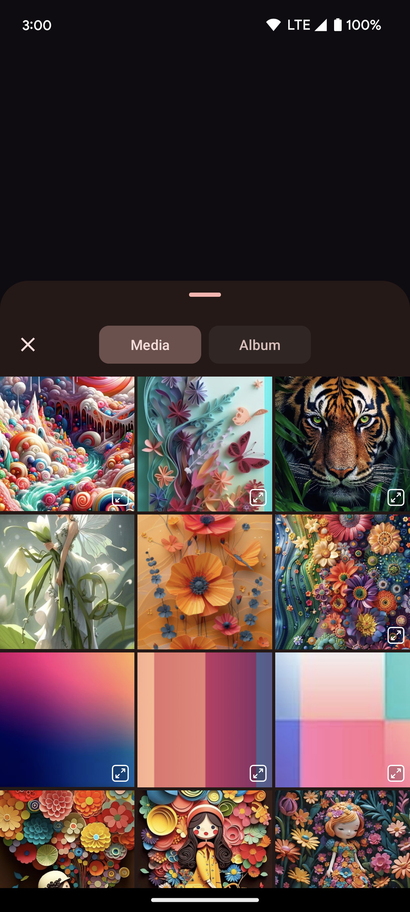
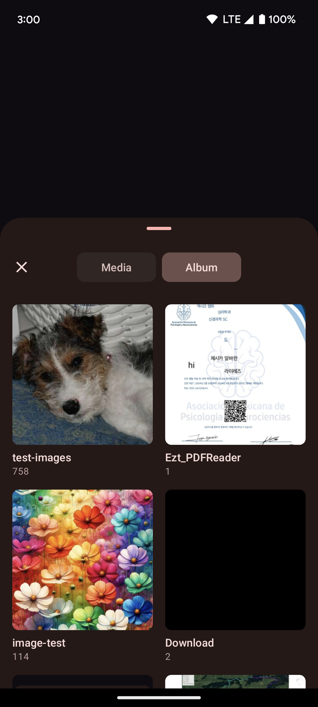
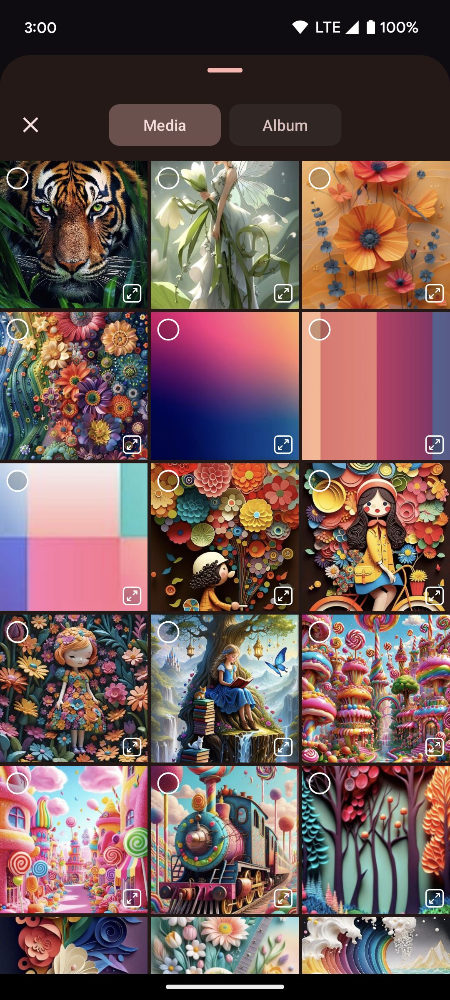
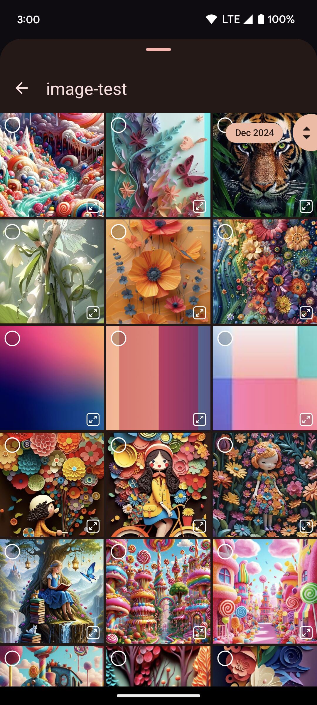
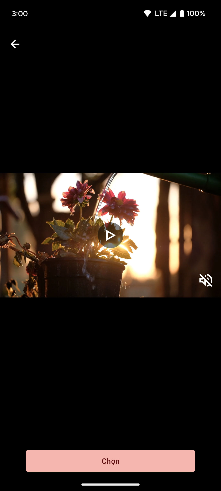

## Material MediaPicker 
- Powerful media picker for android

### Support:
- Pick image, video from gallery
- Single, multi select mode
- Support fast scroll
- Support drag selection
- Support preview media
- Support custom theme, dynamic color theme
- Support light, dark mode base on your theme

### Demo:

https://github.com/user-attachments/assets/6dbf21f3-a3ec-48d7-b421-a3d732a9ae02

|       Empty        |        Media       |        Album       |
|:------------------:|:------------------:|:------------------:|
|  |  |  |
|                    |                    |                    |
|        Multi       |       Detail       |       Preview      |
|  |  |  |

### Install:
Step 1. Add the JitPack repository to your build file
<pre>
dependencyResolutionManagement {
    repositoriesMode.set(RepositoriesMode.FAIL_ON_PROJECT_REPOS)
    repositories {
        mavenCentral()
        maven { url 'https://jitpack.io' }
    }
}
</pre>
Step 2. Add the dependency

<pre>
dependencies {
    implementation 'com.github.MCT-LIB:MediaPicker:{latest-version}'
}
</pre>

### Use:
<pre>
MediaPicker.pick(getSupportFragmentManager(), new MediaPickerOption.Builder()
    /* mode */
    .single(uri -> {})
    .multi(uris -> {})
    .multiExact(uris -> {}, 3)
    .multiRange(uris -> {}, 1, 10)

    /* type */
    .image()
    .video()
    .all()

    /* theme...etc */
    .themeStrategy(M3ThemeStrategy.DEFAULT)
    .themeStrategy(M3ThemeStrategy.INHERIT)
    .themeStrategy(M3ThemeStrategy.DYNAMIC)

    /* build */
    .build()
);
</pre>
